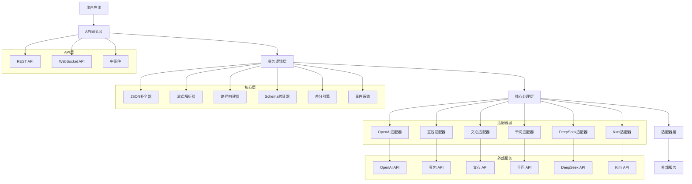
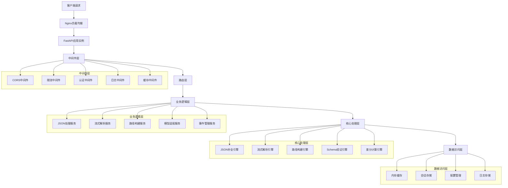
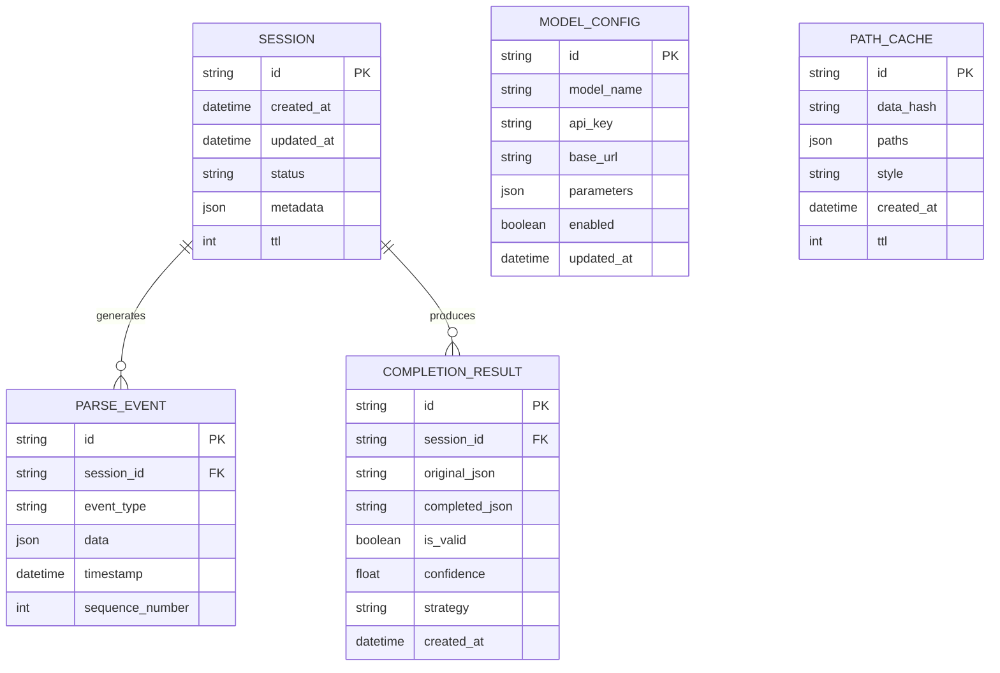

# AgentlyFormat 技术架构文档

## 1. 架构设计



## 2. 技术描述

- **前端**: 无（纯后端服务）
- **后端**: FastAPI + Python 3.8+
- **核心库**: Pydantic, asyncio, httpx, json5
- **API框架**: FastAPI + Uvicorn
- **WebSocket**: FastAPI WebSocket支持
- **异步处理**: asyncio + aiohttp
- **数据验证**: Pydantic v2
- **HTTP客户端**: httpx
- **JSON处理**: json5 + 自定义解析器

## 3. 路由定义

| 路由 | 方法 | 用途 |
|------|------|------|
| `/health` | GET | 健康检查，返回服务状态 |
| `/api/v1/json/complete` | POST | JSON智能补全接口 |
| `/api/v1/parse/stream` | POST | 流式JSON解析接口 |
| `/api/v1/path/build` | POST | 数据路径构建接口 |
| `/api/v1/chat` | POST | 模型聊天接口 |
| `/api/v1/stats` | GET | 系统统计信息接口 |
| `/api/v1/model/config` | GET/POST | 模型配置管理接口 |
| `/api/v1/batch/process` | POST | 批量处理接口 |
| `/ws` | WebSocket | WebSocket实时通信接口 |

## 4. API定义

### 4.1 核心API

#### JSON补全接口
```
POST /api/v1/json/complete
```

**请求参数**:
| 参数名 | 参数类型 | 是否必需 | 描述 |
|--------|----------|----------|------|
| content | string | true | 不完整的JSON字符串 |
| strategy | string | false | 补全策略（smart/conservative/aggressive） |
| timeout | integer | false | 超时时间（秒） |

**响应参数**:
| 参数名 | 参数类型 | 描述 |
|--------|----------|------|
| success | boolean | 请求是否成功 |
| data | object | 补全结果数据 |
| data.completed_json | string | 补全后的JSON字符串 |
| data.is_valid | boolean | 补全结果是否有效 |
| data.confidence | float | 补全置信度（0-1） |
| data.completion_applied | boolean | 是否应用了补全 |
| error | string | 错误信息（如果有） |

**请求示例**:
```json
{
  "content": "{\"name\": \"Alice\", \"age\": 25",
  "strategy": "smart"
}
```

**响应示例**:
```json
{
  "success": true,
  "data": {
    "completed_json": "{\"name\": \"Alice\", \"age\": 25}",
    "is_valid": true,
    "confidence": 0.95,
    "completion_applied": true
  }
}
```

#### 流式解析接口
```
POST /api/v1/parse/stream
```

**请求参数**:
| 参数名 | 参数类型 | 是否必需 | 描述 |
|--------|----------|----------|------|
| session_id | string | false | 会话ID（不提供则自动创建） |
| chunk | string | true | JSON数据块 |
| is_final | boolean | false | 是否为最后一个数据块 |

**响应参数**:
| 参数名 | 参数类型 | 描述 |
|--------|----------|------|
| success | boolean | 请求是否成功 |
| data | object | 解析结果数据 |
| data.session_id | string | 会话ID |
| data.parsed_data | object | 当前解析的数据 |
| data.is_complete | boolean | 解析是否完成 |
| data.progress | float | 解析进度（0-1） |

#### 路径构建接口
```
POST /api/v1/path/build
```

**请求参数**:
| 参数名 | 参数类型 | 是否必需 | 描述 |
|--------|----------|----------|------|
| data | object | true | 要构建路径的JSON数据 |
| style | string | false | 路径风格（dot/slash/bracket） |
| include_arrays | boolean | false | 是否包含数组索引 |

**响应参数**:
| 参数名 | 参数类型 | 描述 |
|--------|----------|------|
| success | boolean | 请求是否成功 |
| data | object | 路径构建结果 |
| data.paths | array | 路径列表 |
| data.total_count | integer | 路径总数 |
| data.style | string | 使用的路径风格 |

#### 模型聊天接口
```
POST /api/v1/chat
```

**请求参数**:
| 参数名 | 参数类型 | 是否必需 | 描述 |
|--------|----------|----------|------|
| model | string | true | 模型名称（openai/doubao/wenxin等） |
| messages | array | true | 聊天消息列表 |
| stream | boolean | false | 是否流式响应 |
| temperature | float | false | 温度参数（0-2） |
| max_tokens | integer | false | 最大token数 |

**响应参数**:
| 参数名 | 参数类型 | 描述 |
|--------|----------|------|
| success | boolean | 请求是否成功 |
| data | object | 聊天响应数据 |
| data.content | string | 响应内容 |
| data.model | string | 使用的模型 |
| data.usage | object | token使用情况 |

### 4.2 WebSocket API

#### 连接地址
```
ws://localhost:8000/ws
```

#### 消息格式

**客户端发送消息**:
```json
{
  "type": "parse",
  "session_id": "session_123",
  "data": "{\"partial\": \"json\"}"
}
```

**服务端响应消息**:
```json
{
  "type": "parse_result",
  "session_id": "session_123",
  "data": {
    "parsed_data": {"partial": "json"},
    "is_complete": false,
    "progress": 0.5
  }
}
```

## 5. 服务器架构图



## 6. 数据模型

### 6.1 数据模型定义



### 6.2 核心数据结构

#### 会话数据 (Session)
```python
from dataclasses import dataclass
from datetime import datetime
from typing import Optional, Dict, Any

@dataclass
class Session:
    id: str
    created_at: datetime
    updated_at: datetime
    status: str  # 'active', 'completed', 'error'
    metadata: Dict[str, Any]
    ttl: int  # 生存时间（秒）
    
    # 运行时数据
    current_data: Optional[Dict[str, Any]] = None
    processed_chunks: int = 0
    total_chunks: int = 0
    buffer: str = ""
```

#### 解析事件 (ParseEvent)
```python
from enum import Enum
from dataclasses import dataclass
from datetime import datetime
from typing import Dict, Any

class EventType(Enum):
    DELTA = "delta"
    ERROR = "error"
    COMPLETE = "complete"
    PROGRESS = "progress"

@dataclass
class ParseEvent:
    id: str
    session_id: str
    event_type: EventType
    data: Dict[str, Any]
    timestamp: datetime
    sequence_number: int
```

#### 补全结果 (CompletionResult)
```python
@dataclass
class CompletionResult:
    original_json: str
    completed_json: str
    is_valid: bool
    confidence: float
    strategy: str
    error_message: Optional[str] = None
    repair_trace: Optional[List[str]] = None
    processing_time: float = 0.0
```

#### 模型配置 (ModelConfig)
```python
@dataclass
class ModelConfig:
    model_name: str
    api_key: str
    base_url: str
    timeout: int = 30
    max_retries: int = 3
    parameters: Dict[str, Any] = None
    enabled: bool = True
    
    def __post_init__(self):
        if self.parameters is None:
            self.parameters = {}
```

### 6.3 数据定义语言 (DDL)

由于AgentlyFormat主要使用内存存储和缓存，以下是内存数据结构的初始化代码：

#### 会话存储初始化
```python
# 会话存储
class SessionStore:
    def __init__(self):
        self.sessions: Dict[str, Session] = {}
        self.events: Dict[str, List[ParseEvent]] = {}
        self.completion_cache: Dict[str, CompletionResult] = {}
        self.path_cache: Dict[str, List[str]] = {}
    
    def create_session(self, session_id: str) -> Session:
        session = Session(
            id=session_id,
            created_at=datetime.now(),
            updated_at=datetime.now(),
            status='active',
            metadata={},
            ttl=3600  # 1小时
        )
        self.sessions[session_id] = session
        self.events[session_id] = []
        return session
    
    def cleanup_expired_sessions(self):
        now = datetime.now()
        expired_sessions = [
            session_id for session_id, session in self.sessions.items()
            if (now - session.created_at).total_seconds() > session.ttl
        ]
        
        for session_id in expired_sessions:
            self.delete_session(session_id)
```

#### 配置存储初始化
```python
# 模型配置存储
class ConfigStore:
    def __init__(self):
        self.model_configs: Dict[str, ModelConfig] = {}
        self.system_config: Dict[str, Any] = {
            'max_chunk_size': 1024 * 1024,  # 1MB
            'session_ttl': 3600,  # 1小时
            'max_sessions': 1000,
            'rate_limit_enabled': True,
            'rate_limit_requests': 100,
            'rate_limit_window': 60
        }
    
    def load_default_configs(self):
        """加载默认模型配置"""
        default_configs = [
            ModelConfig(
                model_name='openai',
                api_key=os.getenv('OPENAI_API_KEY', ''),
                base_url='https://api.openai.com/v1',
                timeout=30,
                max_retries=3
            ),
            ModelConfig(
                model_name='doubao',
                api_key=os.getenv('DOUBAO_API_KEY', ''),
                base_url='https://ark.cn-beijing.volces.com/api/v3',
                timeout=30,
                max_retries=3
            )
            # ... 其他模型配置
        ]
        
        for config in default_configs:
            if config.api_key:  # 只有配置了API密钥的模型才启用
                self.model_configs[config.model_name] = config
```

#### 缓存存储初始化
```python
# 缓存存储
class CacheStore:
    def __init__(self, max_size: int = 1000, ttl: int = 300):
        self.max_size = max_size
        self.ttl = ttl
        self.cache: Dict[str, Dict[str, Any]] = {}
        self.access_times: Dict[str, datetime] = {}
    
    def get(self, key: str) -> Optional[Any]:
        if key in self.cache:
            # 检查是否过期
            if self._is_expired(key):
                self.delete(key)
                return None
            
            # 更新访问时间
            self.access_times[key] = datetime.now()
            return self.cache[key]['value']
        return None
    
    def set(self, key: str, value: Any) -> None:
        # 如果缓存已满，删除最旧的条目
        if len(self.cache) >= self.max_size:
            self._evict_oldest()
        
        self.cache[key] = {
            'value': value,
            'created_at': datetime.now()
        }
        self.access_times[key] = datetime.now()
    
    def _is_expired(self, key: str) -> bool:
        if key not in self.cache:
            return True
        
        created_at = self.cache[key]['created_at']
        return (datetime.now() - created_at).total_seconds() > self.ttl
    
    def _evict_oldest(self) -> None:
        if not self.access_times:
            return
        
        oldest_key = min(self.access_times.keys(), 
                        key=lambda k: self.access_times[k])
        self.delete(oldest_key)
```

## 7. 性能优化策略

### 7.1 内存优化
- 环形缓冲区减少内存分配
- 及时清理过期会话和缓存
- 使用弱引用避免循环引用
- 对象池复用减少GC压力

### 7.2 并发优化
- 异步I/O处理网络请求
- 信号量控制并发数量
- 连接池复用HTTP连接
- 事件循环优化减少上下文切换

### 7.3 缓存策略
- LRU缓存常用补全结果
- 路径构建结果缓存
- 模型响应缓存
- 配置热重载缓存

### 7.4 网络优化
- HTTP/2支持
- 连接复用和保活
- 请求压缩
- 超时和重试机制

---

**AgentlyFormat技术架构** - 高性能、可扩展的大模型JSON处理解决方案 🚀